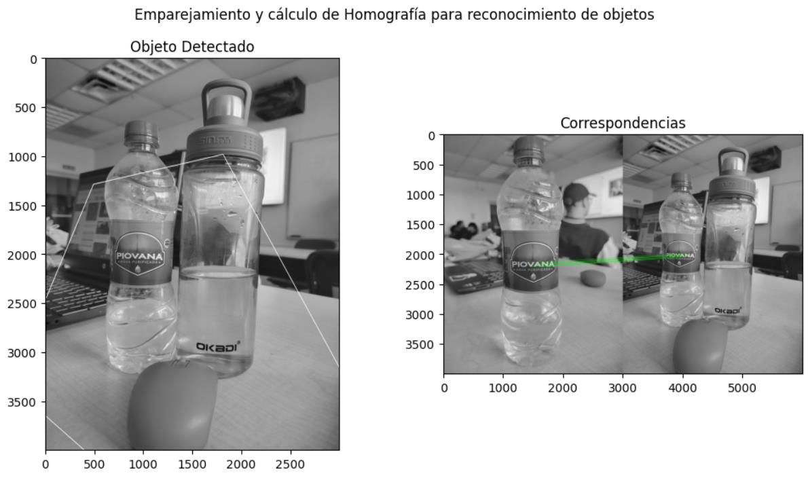

# Laboratorio#4 Segmentación y Reconocimiento

Este laboratorio explora técnicas avanzadas de procesamiento de imágenes utilizadas en flujos de trabajo modernos de visión artificial. El objetivo es comprender cómo se pueden analizar y mejorar computacionalmente estructuras visuales complejas.

El laboratorio demuestra operaciones clave de preprocesamiento que constituyen pasos fundamentales para los sistemas de visión artificial basados ​​en aprendizaje profundo.

## Objetivos
- Aplicar operaciones avanzadas de procesamiento de imágenes.
- Analizar computacionalmente estructuras visuales complejas.
- Comprender los procesos de preprocesamiento para IA basada en visión.
- Desarrollar intuición para operaciones convolucionales.
- Preparar datos de imagen para aplicaciones de aprendizaje profundo.

## Conceptos aplicados
- Preprocesamiento avanzado de imágenes.
- Análisis visual estructural.
- Conceptos de filtrado espacial.
- Técnicas de mejora de características.
- Pipelines de visión computacional.

## El laboratorio demuestra
- Aplicar técnicas avanzadas de procesamiento a imágenes digitales.
- Mejorar y analizar estructuras visuales.
- Explorar relaciones espaciales en datos de imagen.
- Comprender las etapas de preprocesamiento para modelos de visión artificial.
- Interpretar los resultados visuales procesados.

## Preview

## Resultados del aprendizaje
- El preprocesamiento avanzado mejora la detectabilidad de las características.
- El análisis de la estructura visual facilita las tareas de visión artificial.
- El procesamiento espacial es esencial para los modelos convolucionales.
- La comprensión de los flujos de procesamiento mejora el diseño de los sistemas de IA.

## Autor
Rebeca Mendoza, <b>[LinkedIn](https://www.linkedin.com/in/rebeca-mendoza-240401375/)</b>
